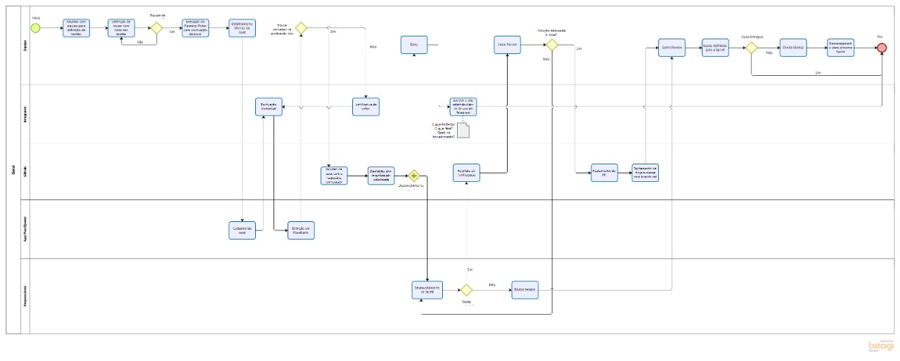
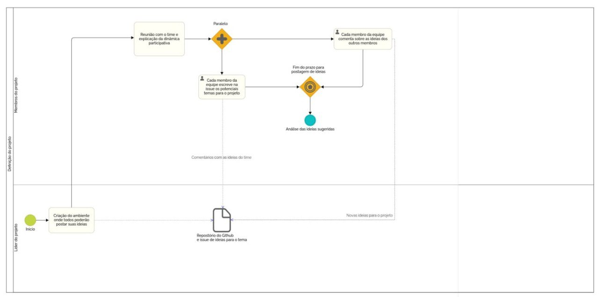
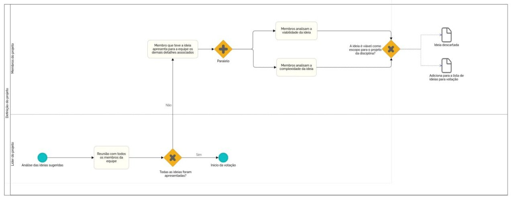
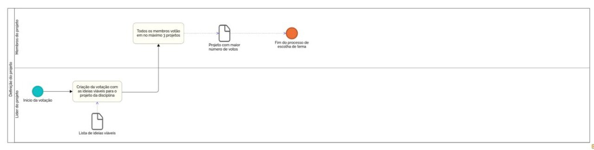
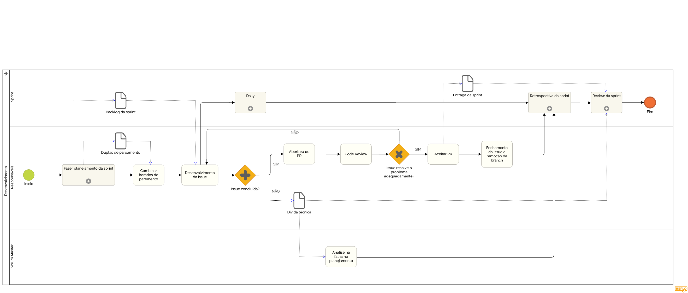
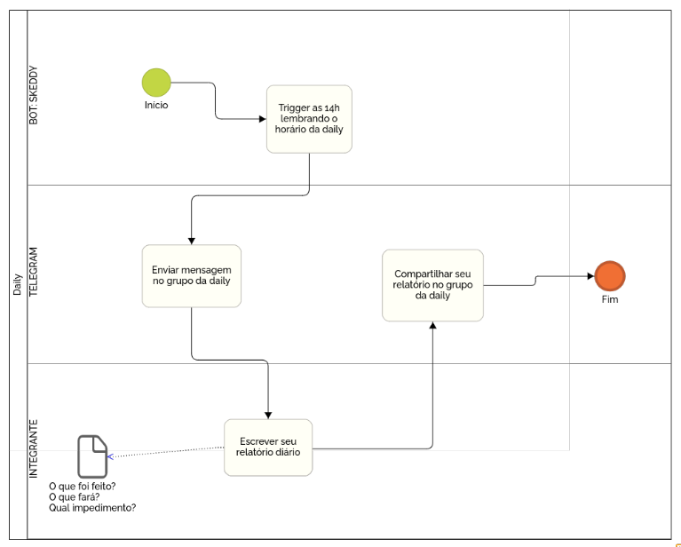
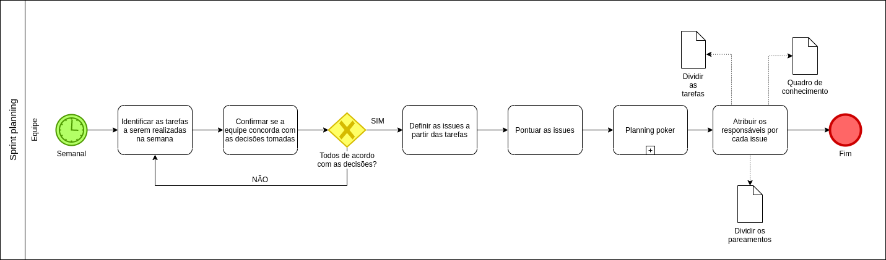
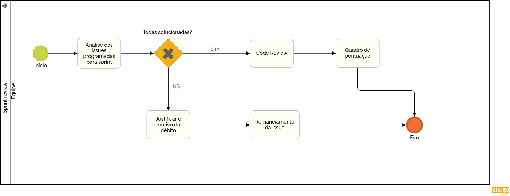
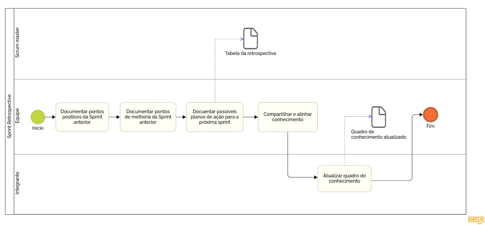
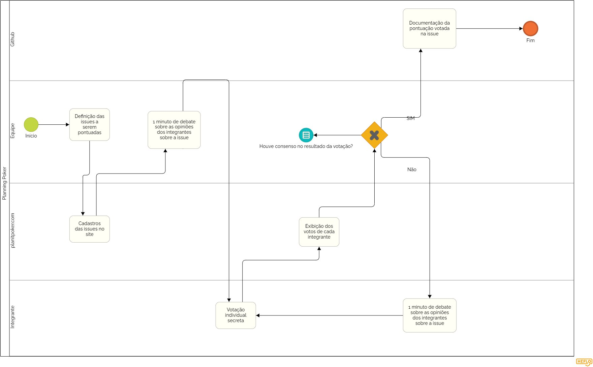

# 
 Modelagem BPMN

BPMN (Business Process Model and Notation) é uma representação gráfica feita a partir de ícones que simbolizam o fluxo de um determinado processo. 

A equipe do projeto Animalesco, por meio da notação BPMN, criou um mapeamento dos processos utilizados. Os diagramas presentes neste documento envolvem o processo inteiro, assim como diagramas de subprocessos com o intuito de um melhor compreendimento dos processos e aplicar de forma padronizada dentro da equipe.

#### Histórico de Versão
|    Data    | Versão | Descrição            | Autor(es)       |
| :--------: | :----: | :------------------: | :-------------: |
| 05/08/2021 |  0.1   | Criação do documento  | Vinicius Oliveira |
| 05/08/2021 |  0.2   | Adição de diagramas do BPMN  | Vinicius Oliveira, Durval Carvalho, Leonardo Gomes, Daniela Soares, João Vitor Lopes, Lorrany Souza, Hugo Sobral, Rafãel Leão |
| 05/08/2021 |  0.3   | Adição de áudios explicativos dos BPMN  | Vinicius Oliveira |
| 06/08/2021 |  1.0   | Revisão do documento | Hugo Sobral |

## 1. Descrição Geral

<audio controls="controls">
    <source type="audio/mp3" src="../assets/audios/bpmn/diagrama-geral.oga"></source>
</audio>

    
    <figcaption align='center'>
        <b>Figura 1: Diagrama de Descrição Geral</b>
         
        <small>Autor: Vinícius Oliveira, 2021.</small>
    </figcaption>

## 2. Definição do Projeto

<audio controls="controls">
    <source type="audio/mp3" src="../assets/audios/bpmn/definicao-projeto.aac"></source>
</audio>

    
    <figcaption align='center'>
        <b>Figura 2: Diagrama de Definição do Projeto</b>
         
        <small>Autor: Durval Carvalho, 2021.</small>
    </figcaption>

    
    <figcaption align='center'>
        <b>Figura 3: Diagrama de Definição do Projeto</b>
         
        <small>Autor: Durval Carvalho, 2021.</small>
    </figcaption>

    
    <figcaption align='center'>
        <b>Figura 4: Diagrama de Definição do Projeto</b>
         
        <small>Autor: Durval Carvalho, 2021.</small>
    </figcaption>

## 3. Desenvolvimento

<audio controls="controls">
    <source type="audio/mp3" src="../assets/audios/bpmn/desenvolvimento.oga"></source>
</audio>

    
    <figcaption align='center'>
        <b>Figura 5: Diagrama de Desenvolvimento</b>
         
        <small>Autor: Leonardo Gomes, 2021.</small>
    </figcaption>

## 4. Daily

<audio controls="controls">
    <source type="audio/mp3" src="../assets/audios/bpmn/daily.mp3"></source>
</audio>

    
    <figcaption align='center'>
        <b>Figura 6: Diagrama de Daily</b>
         
        <small>Autor: Daniela Soares, 2021.</small>
    </figcaption>

## 5. Sprint Planning

<audio controls="controls">
    <source type="audio/mp3" src="../assets/audios/bpmn/sprint-planning.mp3"></source>
</audio>

    
    <figcaption align='center'>
        <b>Figura 7: Diagrama de Sprint Planning</b>
         
        <small>Autor: João Vitor Lopes, 2021.</small>
    </figcaption>

## 6. Sprint Review

<audio controls="controls">
    <source type="audio/mp3" src="../assets/audios/bpmn/sprint-review.mp3"></source>
</audio>

    
    <figcaption align='center'>
        <b>Figura 8: Diagrama de Sprint Review</b>
         
        <small>Autor: Lorrany Souza, 2021.</small>
    </figcaption>

## 7. Sprint Retrospective

<audio controls="controls">
    <source type="audio/mp3" src="../assets/audios/bpmn/sprint-retrospective.oga"></source>
</audio>

    
    <figcaption align='center'>
        <b>Figura 9: Diagrama de Sprint Retrospective</b>
         
        <small>Autor: Hugo Sobral, 2021.</small>
    </figcaption>

## 8. Planning Poker

<audio controls="controls">
    <source type="audio/mp3" src="../assets/audios/bpmn/planning-poker.oga"></source>
</audio>

    
    <figcaption align='center'>
        <b>Figura 10: Diagrama de Planning Poker</b>
         
        <small>Autor: Rafael Leão, 2021.</small>
    </figcaption>

### Bibliografia

1. HEFLO: Ferramenta para criação de diagramas BPMN. Disponível em: https://www.heflo.com/pt-br/tour-heflo-bpm/ (Último acesso em 04/08/2021)
2. SERRANO, Milene. Arquitetura e Desenho de Software AULA – Notação BPMN. 43 slides. Disponível em: https://aprender3.unb.br/pluginfile.php/897126/mod_label/intro/Arquitetura%20e%20Desenho%20de%20software%20-%20Aula%20BPMN%20Exemplos%20-%20Profa.%20Milene.pdf (Último acesso em 05/08/2021)
3. Modelagem de Processo. **Banquinha Web**. Disponível em https://desenhosoftware-2018-2.github.io/wiki/modelagemProcesso (Último acesso em 05/08/2021)
