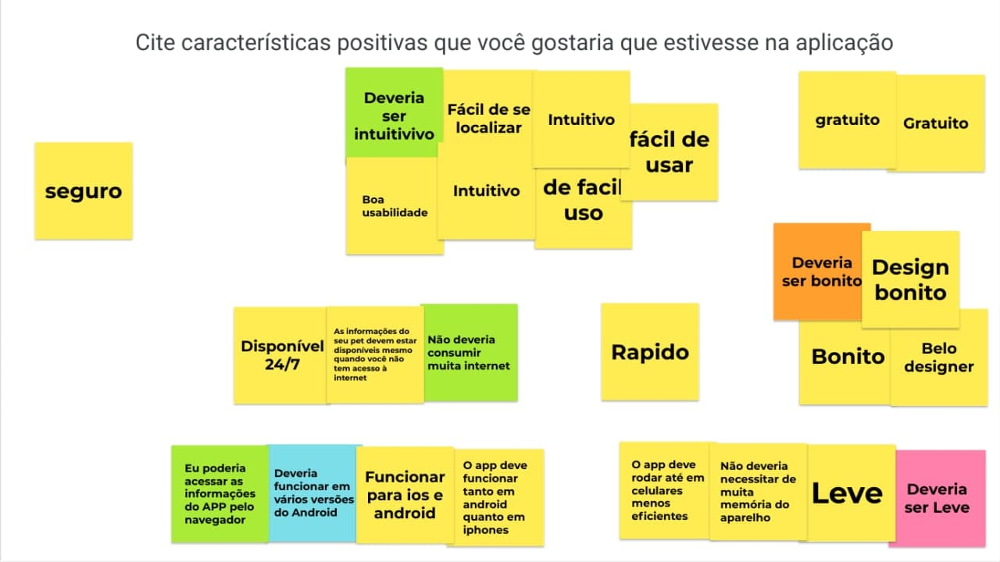

# 
 Mapa Mental

#### Histórico de Versão
|    Data    | Versão | Descrição            |    Autor(es)    |
| :--------: | :----: | :------------------: | :-------------: |
| 30/07/2021 |  0.1   | Criação do documento | Leonardo Gomes  |
| 30/07/2021 |  0.2   | Criação da Metologia e Introdução | Leonardo Gomes e Durval Carvalho  |
| 03/08/2021 |  1.0   | Descrição do Brainstorm e requisitos elicitados | Leonardo Gomes  |

## 1. Introdução

O **Brainstorming** é uma técnica feita em equipe, que busca explorar a criatividade e o compartilhamento de ideias para resolver problemas ou dar à vida a vários questionamentos e respostas que se não feito em grupo pode não ser tão aproveitado.[1]

Um das peças fundamentais para a criação do **Brainstorming** é a velocidade que as ideias são expostas e assim surje um pilar fundamental que se baseaia em não criticar as ideias e o fluxo de raciocinio, pois o mesmo podem gerar ideias melhores e mais concisas do que pode ser o objetivo esperado.

## 2. Metodologia

O objetivo desse **Brainstorming** é elicitar o máximo de requisitos de uma forma rápida e fácil. Dessa forma, para a criação desse documento utilizamos o [*Jamboard*](https://jamboard.google.com/), site da Google que possibilita o compartilhamento de ideias rápido e fácil por meio de "postite". Foi criada uma dinâmica pelos integrantes Leonardo Gomes e Durval Carvalho, com o objetivo de criar uma dinâmica mais fluida e que possa falar mais ainda do projeto.

Essa dinâmica se baseia em 6 perguntas, sendo elas:

| Perguntas |
| :-: |
| Quais informações você gostaria que tivesse na aplicação? |
| Quais animais a aplicação deveria abordar? |
| Quais funcionalidades a aplicação deveria ter? |
| Quais funcionalidades não deveriam estar presentes? |
| Cite características positivas que você gostaria que tivesse na aplicação? |
| Em quais plataformas a aplicação deveria estar presente? |

Com essas perguntas temos a intenção de poder coletar requisitos funcionais e não funcionais. Para cada pergunta foi dado 1 minuto para que todos os integrantes pudessem pensar em quantas respostas fossem necessárias para uma mesma pergunta.

## 3. *Brainstorming*

Esse tópico será apresentado as informações referentes a cada pergunta e o que foi possível coletar das mesmas.

### 3.1 Quais informações você gostaria que tivesse na aplicação?

  
  <figcaption align='center'>
      <b>Figura 1: Brainstorming referente a pergunta "Quais informações você gostaria que tivesse na aplicação?"</b>
       
      <small>Autores: Daniela, Durval, Hugo, João Vitor, Leonardo, Lorrany, Rafael e Vinícius.</small>
  </figcaption>

#### Respostas

- Controle de vacinas (agenda e histórico)
- Controle de medicação (lembrete)
- Registro de idas ao veterinário
- Controle de desparasitação (agenda)
- Dados do dono do pet (nome, data de nascimento, email,...)
- Dados fixos do animal (nome, data de nascimento,...)
- Controle de peso do animal
- Controle de altura do animal
- Controle de banhos (agenda, lembrete, histórico)

### 3.2 Quais animais a aplicação deveria abordar? 

  
  <figcaption align='center'>
      <b>Figura 1: Brainstorming referente a pergunta "Quais animais a aplicação deveria abordar?"</b>
       
      <small>Autores: Daniela, Durval, Hugo, João Vitor, Leonardo, Lorrany, Rafael e Vinícius.</small>
  </figcaption>

#### Respostas

Possiveis animais:
- Gato
- Cachorro
- Coelho
- Aves
- Roedores
- Cavalo
- Gado

### 3.3 Quais funcionalidades a aplicação deveria ter?

  
  <figcaption align='center'>
      <b>Figura 1: Brainstorming referente a pergunta "Quais funcionalidades a aplicação deveria ter?"</b>
       
      <small>Autores: Daniela, Durval, Hugo, João Vitor, Leonardo, Lorrany, Rafael e Vinícius.</small>
  </figcaption>

#### Respostas

- Controle de vacinas (agenda e histórico)
- Controle de medicação (lembrete)
- Registro de idas ao veterinário
- Dados do dono do pet (nome, data de nascimento, email,...)
- Cadastro do animal
- Controle de peso do animal
- Controle de banhos (agenda, lembrete, histórico)
- Gerar relatório sobre andamento da saúde do animal

### 3.4 Quais funcionalidades não deveriam estar presentes?

  
  <figcaption align='center'>
      <b>Figura 1: Brainstorming referente a pergunta "Quais funcionalidades não deveriam estar presentes?"</b>
       
      <small>Autores: Daniela, Durval, Hugo, João Vitor, Leonardo, Lorrany, Rafael e Vinícius.</small>
  </figcaption>

#### Respostas

O aplicativo não deve apresentar:

- Rede social (compartilhamento de foto dos animais, chat entre donos, fazer postagem)
- Vender produtos
- Marcar consultas

### 3.5 Cite características positivas que você gostaria que tivesse na aplicação?

  
  <figcaption align='center'>
      <b>Figura 1: Brainstorming referente a pergunta "Cite características positivas que você gostaria que tivesse na aplicação?"</b>
       
      <small>Autores: Daniela, Durval, Hugo, João Vitor, Leonardo, Lorrany, Rafael e Vinícius.</small>
  </figcaption>

#### Respostas

- Seguro
- Rápido
- Leve
- Disponível a todo momento
- Multiplataforma
- Fácil de usar
- Gratuito
- Design bonito

### 3.6 Em quais plataformas a aplicação deveria estar presente?

  
  <figcaption align='center'>
      <b>Figura 1: Brainstorming referente a pergunta "Em quais plataformas a aplicação deveria estar presente?"</b>
       
      <small>Autores: Daniela, Durval, Hugo, João Vitor, Leonardo, Lorrany, Rafael e Vinícius.</small>
  </figcaption>

#### Respostas

- IOS
- Android
- Windows phone
- Web

## 4. Requisitos levantados

### 4.1 Requisitos funcionais

| ID | Nome |
| :-: | :-: |
| RF01 | Login |
| RF02 | Cadastro |
| RF03 | Registrar animal |
| RF04 | Editar informações do animal |
| RF05 | Calendário |
| RF06 | Agendar vacina |
| RF08 | Remover vacina da agenda |
| RF09 | Adicionar lembrete de medicação |
| RF10 | Remover lembrete de medicação |
| RF11 | Agendar banho |
| RF12 | Remover banho da agenda |
| RF13 | Registro ida ao veterinário |
| RF14 | Registro do peso do animal |
| RF15 | Registro da altura do animal |
| RF16 | Gráfico relacionado a altura do animal |
| RF17 | Gráfico relacionado ao peso do animal |
| RF18 | Histórico de vacinas |
| RF19 | Histórico de medicação |
| RF20 | Histórico de banho |
| RF21 | Gerar relatório sobre a saúde do animal |

### 4.1 Requisitos não funcionais

| ID | Nome |
| :-: | :-: |
| RNF01 | Interface fácil e intuitiva |
| RNF02 | Interface bonita |
| RNF03 | Leve |
| RNF04 | Seguro |
| RNF05 | Rápido |
| RNF06 | Gratuito |
| RNF08 | Disponivel a todo momento |
| RNF09 | Compatibilidade com Android |
| RNF10 | Compatibilidade com IOS |
| RNF11 | Compatibilidade com Windows phone |
| RNF12 | Compatibilidade com qualquer navegador WEB |

### 4.2 Requisitos não funcionais

## Gravações Disponíveis

<iframe width="560" height="315" src="https://www.youtube.com/embed/0-izTAvZbas" title="Gravação planning da sprint 01" frameborder="0" allow="accelerometer; autoplay; clipboard-write; encrypted-media; gyroscope; picture-in-picture" allowfullscreen></iframe>

## Bibliografia

- [1] WOEBCKEN, Cayo. O que é brainstorming e as 7 melhores técnicas para a tomada de decisões inteligentes. Disponível em: https://rockcontent.com/blog/brainstorming/. Último acesso em: 03/08/2021.

- [2] Wiki PAX App: https://pax-app.github.io/Wiki/#/. Último acesso em: 03/08/2021.

- [3] Wiki Stock App: https://unbarqdsw.github.io/2020.1_G12_Stock/#/. Último acesso em: 03/08/2021.

