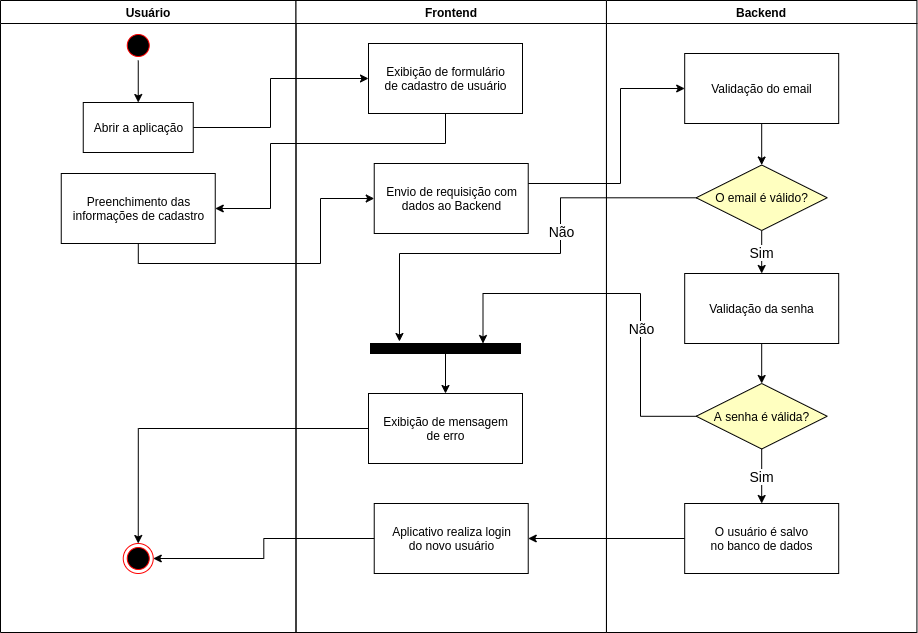
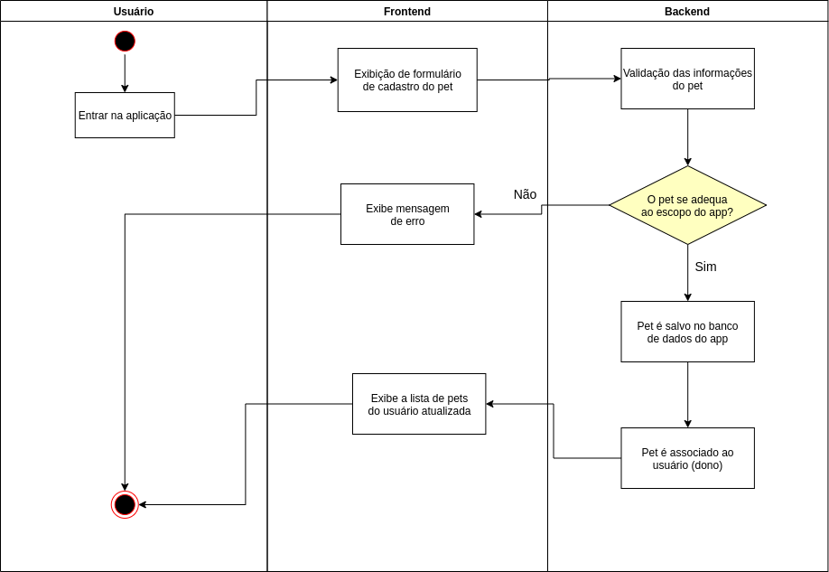
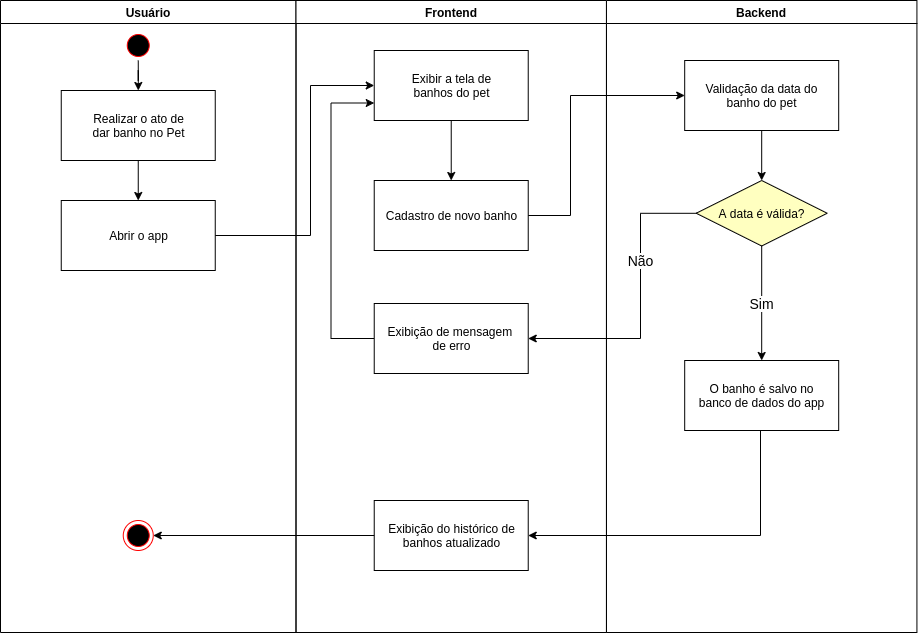
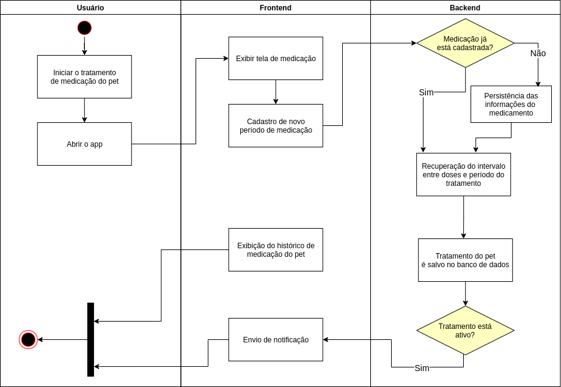

# 
 Diagrama de Atividades

### Histórico de Versão
|    Data    | Versão | Descrição            | Autor(es)       |
| :--------: | :----: | :------------------: | :-------------: |
| 16/08/2021 |  0.1   | Confecção inicial do documento | Hugo Sobral |
| 16/08/2021 |  0.2   | Inclusão do diagrama de cadastro de pets | Hugo Sobral |
| 16/08/2021 |  0.3   | Inclusão do diagrama de cadastro de usuários | Hugo Sobral |
| 16/08/2021 |  0.4   | Inclusão do diagrama de banhos de pets | Hugo Sobral |
| 16/08/2021 |  0.5   | Inclusão do diagrama de medicação de pets | Hugo Sobral |

## 1. Introdução

A UML (***Unified Modeling Language***, **Linguagem de Modelagem Unificada** em tradução livre) é uma notação gráfica para modelagem de contextos de software que atende ao paradigma de Orientação a Objetos. Dentro dos diagramas descritos pela notação, destacam-se as descrições de detalhamento dos contextos estrutuais (também chamados de estáticos); comportamentais (também chamados de dinâmicos); organizacionais (diagrama que se responsabilida por descrever os pacotes da solução computacional); e os anotacionais (também chamados de explicativos).

Dentro da gama dos diagramas dinâmicos, destaca-se o **Diagrama de Atividades**. O **Diagrama de Atividades** se responsabiliza por descrever um fluxo de atividades que representam a utilização da solução computacional em um determinado contexto. Isto é, o Diagrama de Atividades descreve o caminho seguido a partir de uma determinada ação, com foco nos procedimentos, regras de negócio e fluxo de trabalho. Tal descrição pode se utilizar de elementos gráficos da notação UML para descrever condições, ações e estados.

## 2. Metodologia

## 3. Diagrama de Atividades

### 3.1 Cadastro de usuário

    
    <figcaption align='center'>
        <b>Figura 1: Diagrama de atividades - cadastro de usuário</b>
         
        <small>Autor: Hugo Sobral.</small>
    </figcaption>

### 3.2 Cadastro de pets

    
    <figcaption align='center'>
        <b>Figura 2: Diagrama de atividades - cadastro de pet</b>
         
        <small>Autor: Hugo Sobral.</small>
    </figcaption>

### 3.3 Banhos do pet

    
    <figcaption align='center'>
        <b>Figura 3: Diagrama de atividades - banhos do pet</b>
         
        <small>Autor: Hugo Sobral.</small>
    </figcaption>

### 3.4 Controle de medicações do pet

    
    <figcaption align='center'>
        <b>Figura 4: Diagrama de atividades - controle de medicação do pet</b>
         
        <small>Autor: Hugo Sobral.</small>
    </figcaption>

## 4. Conclusão

## Bibliografia

1. https://www.uml-diagrams.org/activity-diagrams.html (Último acesso em 16/08/2021)

2. AULA - MODELAGEM UML ESTÁTICA. Disponível em:  https://aprender3.unb.br/pluginfile.php/897132/mod_label/intro/Arquitetura%20e%20Desenho%20de%20Software%20-%20Aula%20Modelagem%20UML%20Est%C3%A1tica%20-%20Profa.%20Milene.pdf (Último acesso em 16/08/2021)

3. AULA - MODELAGEM UML DINÂMICA. Disponível em: https://aprender3.unb.br/pluginfile.php/897133/mod_label/intro/Arquitetura%20e%20Desenho%20de%20Software%20-%20Aula%20Modelagem%20UML%20Din%C3%A2mica%20-%20Profa.%20Milene.pdf (Último acesso em 16/08/2021)

4. https://www.lucidchart.com/pages/pt/o-que-e-diagrama-de-atividades-uml (Último acesso em 16/08/2021)

