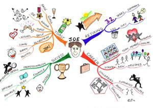
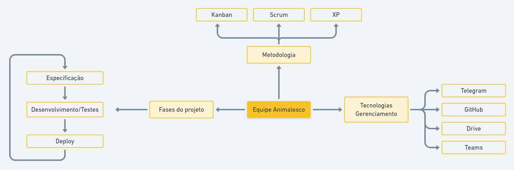

 Mapa Mental

#### Histórico de Versão
|    Data    | Versão | Descrição            |    Autor(es)    |
| :--------: | :----: | :------------------: | :-------------: |
| 29/07/2021 |  0.1   | Criação do documento | Leonardo Gomes  |
| 29/07/2021 |  0.2   | Definição da Introdução | Leonardo Gomes  |
| 29/07/2021 |  0.3   | Descrição do Objetivo | Leonardo Gomes e Lorrany Souza |
| 29/07/2021 |  0.4   | Descrição do mapa mental | Leonardo Gomes e Lorrany Souza |

### 1. Introdução

Os mapas mentais é uma técnica que “servem para tornar visíveis e claros as idéias chaves em que os gestores devem se centrar para uma atividade de busca da solução de problemas, de pesquisa, de tomadas de decisão em qualquer tipo de organização”. (BELLUZZO, 2006). O uso dessa técnica está totalmente ligada "as funções e operações da mente de encadear, relacionar, comparar, classificar, etc, ou seja, processar, de uma forma geral, as informações coletadas no universo exterior quanto do interior". (SILVA, Milena da Costa, 2010).

O uso dessa técnica se torna extremamente importante, no momento que se há a necessidade de documentar, estrututar e criar fluxos mentais de ideias que possam soar vagas, mas que se estruturam e solidificam com o desenvolvimento de artefatos visuais. Para a criação pode ser usado uma folha de papel ou aplicativos ou sites de criação de fluxo e podem ser feitos em grupo ou individualmente.

#### 1.1 Elaboração

Mesmo parecendo um documento livre para modificação, existe alguns etapas que envolve a construção de um mapa mental, segundo Buzan (2005):

- Etapa 1: Uma ideia central representada no centro do diagrama.
- Etapa 2: "Ligue ramos principais à imagem central e una os ramos secundários ao
principais, os terciários aos secundários e assim sucessivamente.". (SILVA, Milena da Costa, 2010).
- Etapa 3: Escreva um única palavra chave por ramo.
- Etapa 4: Utilize imagens durante o processo.

    
    <figcaption align='center'>
        <b>Figura 1: Mapa mental feito a mão</b>
         
        <small>Fonte: http://clakemi.blogspot.com/2007/07/memorizao-atravs-da-tcnica-dos-mapas.html.</small>
    </figcaption>

#### 1.2 Valor

O mapa mental é um documento muito importante para construir, localizar, selecionar, organizar, memorizar, relembrar, sintetizar, aprender e criar ideias, podendo participar a qualquer momento da construção de um projeto. Além disso, é um documento fácil, rapído e de baixo custo, podendo ser feito em papel, celular, computador, quadro branco, etc.

Para software ele entra como um principal fator de compreenção do produto e de desenvolvimento de ideias a qualquer momento do desenvolvimento, desde de a coleta de requisitos até o _deploy_ da aplicação. Esse documento tende a ser uma ferramenta auxiliar que pode ser usada para criação de outros documentos, servindo como base ou como parte fundamental.

### 2. Objetivo

Esse documento tem como objetivo elaborar um mapa mental a respeito das ideias inicias a partir de um brainstorm do projeto Animalesco, da disciplina Arquitetura e Desenho de Software, onde foi discutido ideia do produto, funcionalidades, ambiente, dentre outros tópicos. Esse documento servirá como base para ideias futuras e construções de artefas mediante a definição do projeto, metodologia e tecnologias.

Além de construir uma visão simplista e geral de como foi pensado o projeto e suas funcionalidades, abarcando também stakeholders que podem ser atingidos com o mesmo. 

### 3. Mapa mental

#### 3.1 Visão geral do projeto

A visão geral do projeto consiste em definir conceito, aplicativos similares e listar possíveis funcionalidades, stakeholders, plataformas e tecnologias. Essas ideias foram levantadas a partir de um brainstorm feito por toda a equipe, onde foram aceitos quaisquer ideias a respeito do que poderia ser o projeto. O mapa mental a respeito dessa visão pode ser visto abaixo:

    
    <figcaption align='center'>
        <b>Figura 2: Mapa mental de visão geral do projeto feito pelo Whimsical</b>
         
        <small>Autores: Leonardo Gomes e Lorrany Souza.</small>
    </figcaption>

#### 3.2 Visão geral da equipe

A visão geral da equipe consiste na difinição de possiveis metodologias, tecnologias de gerenciamento e ciclo de vida do projeto. Abarcando futuras decisões, mas agregando valor para conceitos que são definidos ao decorrer do desenvolvimento dos documentos. O mapa mental a respeito dessa visão pode ser visto abaixo:

    
    <figcaption align='center'>
        <b>Figura 3: Mapa mental de visão geral da equipe feito pelo Whimsical</b>
         
        <small>Autores: Leonardo Gomes e Lorrany Souza.</small>
    </figcaption>

### 4. Resultados e Conclusões

### Bibliografia

