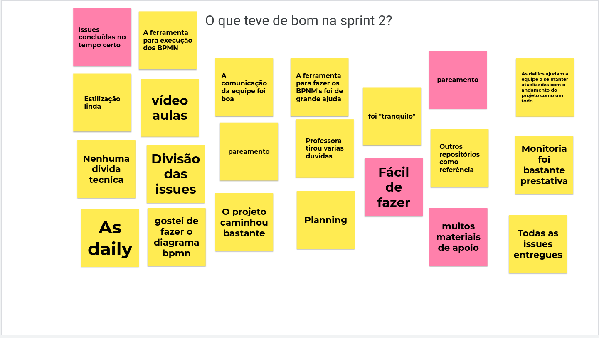
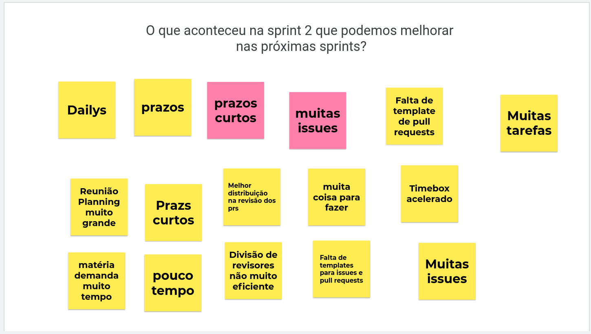
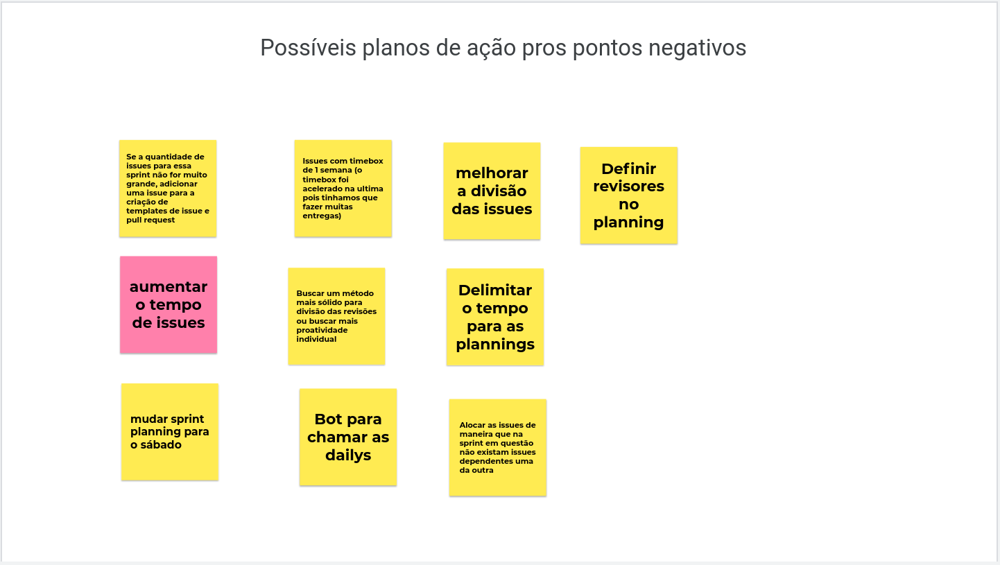

# 
 Resultado sprint 2
> Período: 02/08/2021 até 08/08/2021   
> Data da reunião: 09/08/2021

#### Histórico de Versão

|    Data    | Versão |      Descrição       |     Autor(es)     |
| :--------: | :----: | :------------------: | :---------------: |
| 19/08/2021 |  1.0   | Criação do documento | Hugo Sobral |

 

## Issues entregues
| Número | Issue | Pontuação | Membros |
| -- | -- | -- | -- |
| [#32](https://github.com/UnBArqDsw2021-1/2021.1_G01_Animalesco_docs/issues/32) | Criar documento de metodologia | 3 | Durval Carvalho e Hugo Sobral |
| [#21](https://github.com/UnBArqDsw2021-1/2021.1_G01_Animalesco_docs/issues/21) | Realizar técnica de elicitação de Entrevista | 5 | Hugo Sobral |
| [#19](https://github.com/UnBArqDsw2021-1/2021.1_G01_Animalesco_docs/issues/19) | Realizar método de elicitação questionário | 5 | Durval Carvalho e Leonardo Gomes |
| [#30](https://github.com/UnBArqDsw2021-1/2021.1_G01_Animalesco_docs/issues/30) | Brainstorming para elicitação dos requisitos | 3 | Leonardo Gomes |
| [#17](https://github.com/UnBArqDsw2021-1/2021.1_G01_Animalesco_docs/issues/17) | Baseline de requisitos | 5 | João Vitor Lopes e Rafael Leão |
| [#39](https://github.com/UnBArqDsw2021-1/2021.1_G01_Animalesco_docs/issues/39) | Realizar priorização dos requisitos do backlog | 5 | Daniela Soares e Lorrany Souza |
| [#43](https://github.com/UnBArqDsw2021-1/2021.1_G01_Animalesco_docs/issues/43) | BPMN da definição do projeto | 3 | Durval Carvalho |
| [#50](https://github.com/UnBArqDsw2021-1/2021.1_G01_Animalesco_docs/issues/50) | BPMN da sprint planning | 2 | João Vitor Lopes |
| [#49](https://github.com/UnBArqDsw2021-1/2021.1_G01_Animalesco_docs/issues/49) | BPMN do desenvolvimento | 3 | Leonardo Gomes |
| [#48](https://github.com/UnBArqDsw2021-1/2021.1_G01_Animalesco_docs/issues/48) | BPMN da sprint retrospective | 2 | Hugo Sobral |
| [#47](https://github.com/UnBArqDsw2021-1/2021.1_G01_Animalesco_docs/issues/47) | BPMN do planning poker | 2 | Rafael Leão |
| [#46](https://github.com/UnBArqDsw2021-1/2021.1_G01_Animalesco_docs/issues/46) | BPMN da sprint review | 2 | Lorrany Souza |
| [#45](https://github.com/UnBArqDsw2021-1/2021.1_G01_Animalesco_docs/issues/45) | BPMN da daily | 2 | Daniela Soares |
| [#44](https://github.com/UnBArqDsw2021-1/2021.1_G01_Animalesco_docs/issues/44) | BPMN da descrição geral | 5 | Vinícius Oliveira |
| [#42](https://github.com/UnBArqDsw2021-1/2021.1_G01_Animalesco_docs/issues/42) | Estilização do github pages | -- | Leonardo Gomes |
| [#18](https://github.com/UnBArqDsw2021-1/2021.1_G01_Animalesco_docs/issues/18) | Notação BPMN | -- | Vinícius Oliveira |

#### Pontuação entregue da sprint: 47

## Dívidas técnicas
Não houveram dívidas técnicas durante essa sprint.

 

## Métricas da sprint

### Quadro de conhecimento
O quadro de conhecimento ainda não foi implementado para a sprint 2

### Burndown
A equipe ainda não está utilizando esta métrica.

### Velocity
A equipe ainda não está utilizando está métrica.

 

## Retrospectiva da Sprint

### O que teve de bom na Sprint 2?

### O que aconteceu na Sprint 2 que podemos melhorar?

### Possíveis planos de ação para os pontos negativos

## Observações
Durante o desenvolvimento da Sprint 2, houve o empenho de desenvolvimento de uam iniciativa extra para a realização da estilização da Wiki do repositório para que esta se adequasse ao design idealizado pela equipe. Tal tarefa ficou documentada na issue de ["Estilização do github pages"](https://github.com/UnBArqDsw2021-1/2021.1_G01_Animalesco_docs/issues/42) e o responsável por esta foi o Leonardo Gomes.

A partir da retrospectiva da sprint, fez-se necessário a designação prévia dos revisores para as issues da equipe. 

 

## Gravações disponíveis

<iframe width="560" height="315" src="https://www.youtube.com/embed/p3TMUcadhpc" title="YouTube video player" frameborder="0" allow="accelerometer; autoplay; clipboard-write; encrypted-media; gyroscope; picture-in-picture" allowfullscreen></iframe>

