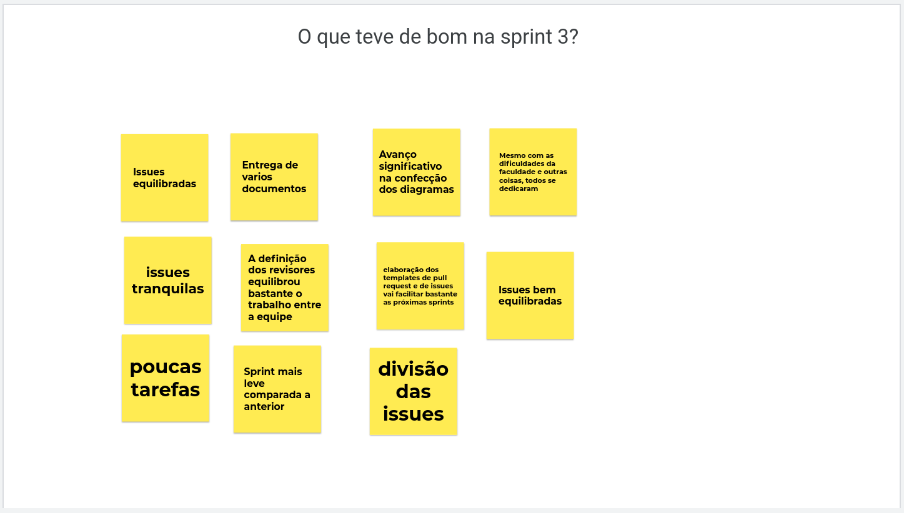
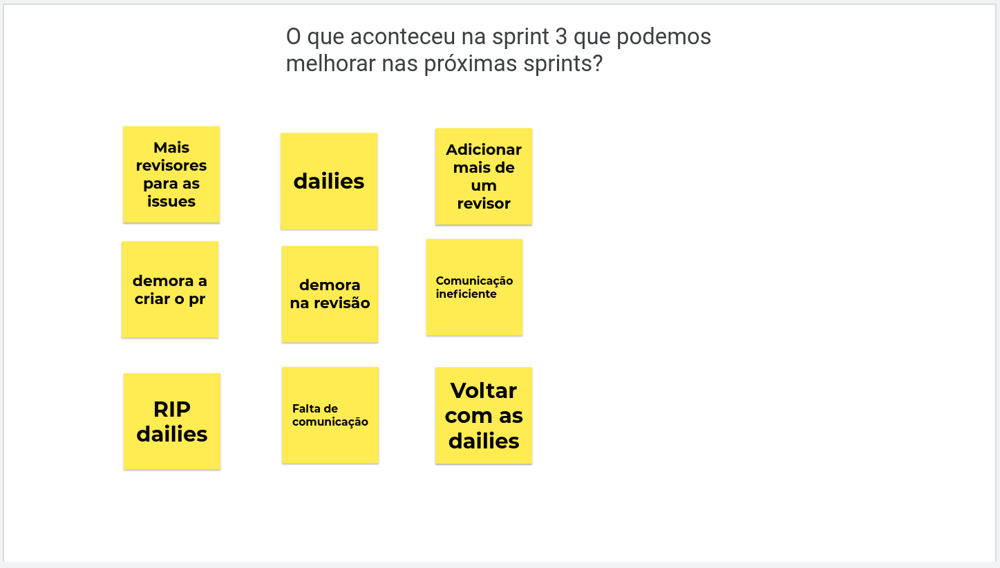
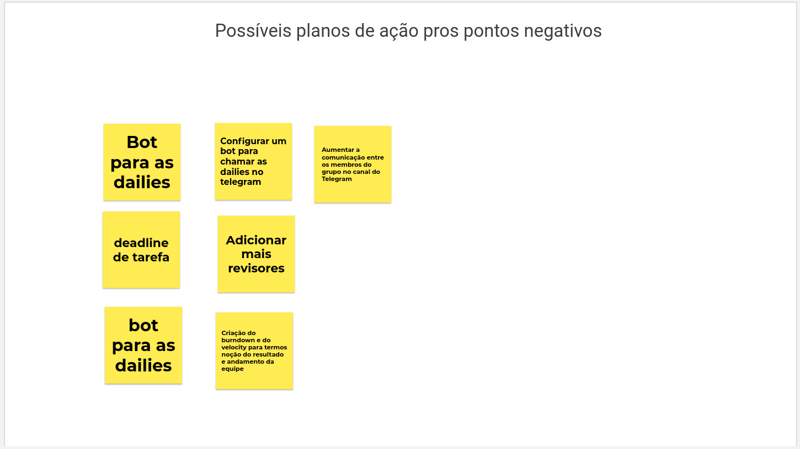

# 
 Resultado sprint 3
> Período: 09/08/2021 até 16/08/2021  
> Data da reunião: 16/08/2021

 

#### Histórico de Versão

|    Data    | Versão |      Descrição       |     Autor(es)     |
| :--------: | :----: | :------------------: | :---------------: |
| 19/08/2021 |  1.0   | Criação do documento | Hugo Sobral |

 

## Issues entregues
| Número | Issue | Pontuação | Membros | Revisores |
| -- | -- | -- | -- | -- | 
| [#62](https://github.com/UnBArqDsw2021-1/2021.1_G01_Animalesco_docs/issues/62) | Confeccionar diagrama de componentes | 8 | Durval Carvalho | Leonardo Gomes |
| [#63](https://github.com/UnBArqDsw2021-1/2021.1_G01_Animalesco_docs/issues/63) | Confeccionar diagrama de sequência | 8 | João Vitor | Vinicius Oliveira |
| [#64](https://github.com/UnBArqDsw2021-1/2021.1_G01_Animalesco_docs/issues/64) | Confeccionar diagrama de comunicação | 5 | Leonardo Gomes | Lorrany Oliveira |
| [#65](https://github.com/UnBArqDsw2021-1/2021.1_G01_Animalesco_docs/issues/65) | Confeccionar diagrama de pacotes | 5 | Vinicius Oliveira | Hugo Sobral |
| [#66](https://github.com/UnBArqDsw2021-1/2021.1_G01_Animalesco_docs/issues/66) | Confeccionar diagrama de atividade | 8 | Hugo Sobral | Rafael Leão |
| [#67](https://github.com/UnBArqDsw2021-1/2021.1_G01_Animalesco_docs/issues/67) | Confeccionar diagrama de estado | 8 | Rafael Leão | Durval Carvalho |
| [#41](https://github.com/UnBArqDsw2021-1/2021.1_G01_Animalesco_docs/issues/41) | Criar templates para issue e para pull requests  | 1 | Durval Carvalho | Hugo Sobral e Leonardo Gomes |
| [#40](https://github.com/UnBArqDsw2021-1/2021.1_G01_Animalesco_docs/issues/40) | Organização do Kanban da equipe  | 2 | Leonardo Gomes | Hugo Sobral |

#### Pontuação entregue da sprint: 45

## Dívidas técnicas

| Número | Issue | Pontuação | Membros | Revisores | Causa |
| -- | -- | -- | -- | -- | -- | 
| [#61](https://github.com/UnBArqDsw2021-1/2021.1_G01_Animalesco_docs/issues/61) | Confeccionar diagrama de classes | 5 | Lorrany Oliveira | Daniela Soares | A revisão ainda está pendente e não conseguiu ser realizada no tempo hábil da sprint |
| [#71](https://github.com/UnBArqDsw2021-1/2021.1_G01_Animalesco_docs/issues/71) | Confeccionar diagrama de entidade relacionamento | 3 | Daniela Soares | João Vitor | O documento que contem o diagrama apresentou defeitos que não conseguiram ser reajeitados no tempo hábil da sprint |
| [#72](https://github.com/UnBArqDsw2021-1/2021.1_G01_Animalesco_docs/issues/72) | Documentação dos resultados da sprint 2 e planejamento da sprint 3 | 2 | Hugo Sobral | Revisor em aberto | A documentação em ata de reunião não foi feita durante a sprint |

 

## Métricas da sprint

### Quadro de conhecimento
O quadro de conhecimento ainda não foi implementado para a sprint 3

### Burndown
A equipe ainda não está utilizando esta métrica.

### Velocity
A equipe ainda não está utilizando está métrica.

 

## Retrospectiva da Sprint

### O que teve de bom na Sprint 3?

### O que aconteceu na Sprint 3 que podemos melhorar?

### Possíveis planos de ação para os pontos negativos

 

## Gravações disponíveis

<iframe width="560" height="315" src="https://www.youtube.com/embed/Ad1iMet6RxM" title="YouTube video player" frameborder="0" allow="accelerometer; autoplay; clipboard-write; encrypted-media; gyroscope; picture-in-picture" allowfullscreen></iframe>

